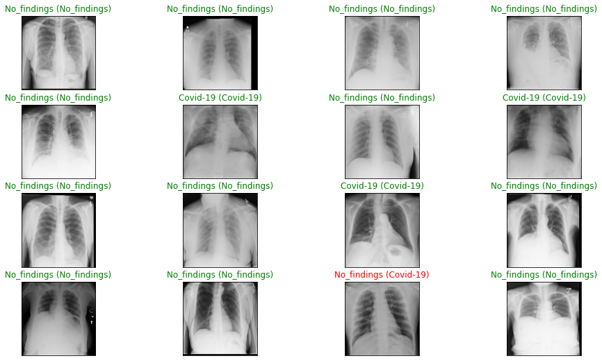

# Detecting COVID-19 in X-ray Images
Detecting COVID-19 in X-ray images with Keras, TensorFlow, and Deep Learning
## Table of contents
- [Business Problem](#business-problem)
- [Data Section](#data-section)
- [Technologies](#technologies)
- [Results Section](#results-section)
- [Discussion Section](#discussion-section)
- [Conclusion](#conclusion)
- [References](#References)
- [Author infos](#author-infos)

---
### Business Problem
##### About COVID-19
The novel coronavirus 2019 (COVID-2019), which first appeared in Wuhan city of China in December 2019, spread rapidly around the world and became a pandemic. It has caused a devastating effect on both daily lives, public health, and the global economy. It is critical to detect the positive cases as early as possible so as to prevent the further spread of this epidemic and to quickly treat affected patients. The need for auxiliary diagnostic tools has increased as there are no accurate automated toolkits available.

##### Detecting COVID-19 in X-ray
Coming down to business problem, our project aims to create a solution that can prevent COVID-19 in an automated way. This operation will be based on X-ray DataSet. However, the challenge is to find an efficient solution for detecting COVID-19 with a high sort of efficiency using deep learning which is the start-of-art of recent technologies, especially in AI.
##### Interested Audience
I have only one tip before we get dive into our amazing project, please do not use this model to detect the novel coronavirus 2019, because the efficient ways are already fixed by the WHO. But students and working professionals in data science are common audience here. So, we may need to fascinate and inspire them all.

---
### Data Section
##### What data is used?
Recent findings obtained using radiology imaging techniques suggest that such images contain salient information about the COVID-19 virus. Application of advanced artificial intelligence (AI) techniques coupled with radiological imaging can be helpful for the accurate detection of this disease and can also be assistive to overcome the problem of a lack of specialized physicians in remote villages.

##### How will we be solving using this data?
As you may know, before creating a DL model that can do a specific task, we need to train it first using some similar data. Therefore, our model will be exposed to a new data that have never seen before, then it will be able to its job more efficiently than humans b, if it trained well.

---
### Technologies
- Python (TenserFlow, Keras, Skit-Learn, Pandas, Numpy…etc)
- Jupyter NoteBook in Colab
---
### Results Section
- Accuracies
<table>
  <tr>
    <td>
      <table>
        <thead>
          <tr>
            <th>  </th><th> Training </th><th> Validation </th> <th> Test </th></tr></thead><tr>
        <td>Accuracy</td>
        <td>?</td>
        <td>?</td>
        <td>?</td>
        </tr>
        <tr>
      <td>Loss</td>
      <td>?</td>
      <td>?</td>
      <td>?</td>
    </tr>
    </table></td>
      <td></td>
    </tr>
  <tr>
    <td><table></table></td>
    <td><table></table></td>
  </tr>

</table>

---

### Discussion Section

---
### Conclusion

---
### References
-[Automated detection of COVID-19 cases using deep neural networks with X-ray images](https://www.ncbi.nlm.nih.gov/pmc/articles/PMC7187882/)
-[Detecting COVID-19 in X-ray images with Keras, TensorFlow, and Deep Learning](https://www.pyimagesearch.com/2020/03/16/detecting-covid-19-in-x-ray-images-with-keras-tensorflow-and-deep-learning/)
-[Plants Identification](https://github.com/zekaouinoureddine/Plants_Identification_DL_SI)

---
### Author infos
- 
---

[Back To The Top](#detecting-covid-19-in-x-ray-images)
